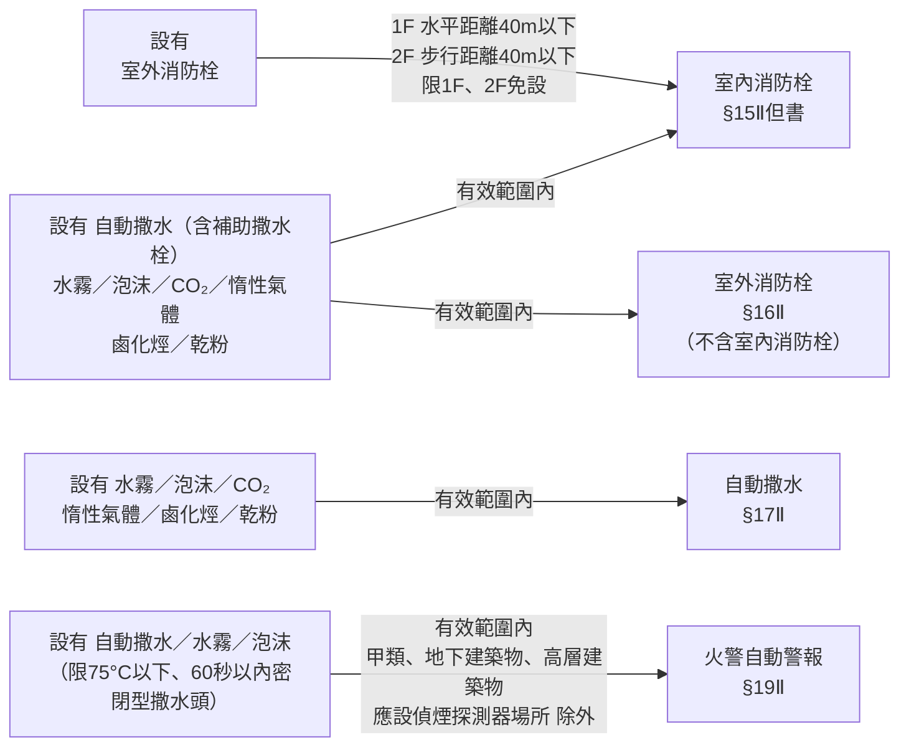

# 第二編 消防設計 — 場所分類與應設場所速查（§12～§30-1）

> 這一編回答**唯一一個問題：這個場所該不該設這項設備？**
> 全部門檻都建立在三個變數上：**用途（§12 分類）× 樓層位置 × 樓地板面積**。

---

## 一、§12 場所分類 — 甲乙丙丁戊

分類記錯，後面全錯。先掌握**分類的邏輯**再記細目。

| 類別 | 核心特徵 | 目數 |
|---|---|---|
| **甲類** | 供公眾使用、人員密集、避難困難、多為不特定人 | 7 目 |
| **乙類** | 供公眾使用但危險度較低，或人員相對特定 | 12 目 |
| **丙類** | 車輛、飛機、電信機器等**特殊設施** | 3 目 |
| **丁類** | 依**危險程度**分級的工作場所 | 3 目 |
| **戊類** | **複合用途**建築物與**地下建築物** | 3 目 |

### 甲類場所（7 目）

| 目 | 內容 |
|---|---|
| （一） | 電影片映演場所（戲院、電影院）、歌廳、舞廳、夜總會、俱樂部、理容院（觀光理髮、視聽理容等）、指壓按摩場所、錄影節目帶播映場所（MTV等）、視聽歌唱場所（KTV等）、酒家、酒吧、酒店（廊） |
| （二） | 保齡球館、撞球場、集會堂、健身休閒中心（含提供指壓、三溫暖等設施之美容瘦身場所）、室內螢幕式高爾夫練習場、遊藝場所、電子遊戲場、資訊休閒場所 |
| （三） | 觀光旅館、飯店、旅館、招待所（**限有寢室客房者**） |
| （四） | 商場、市場、百貨商場、超級市場、零售市場、展覽場 |
| （五） | 餐廳、飲食店、咖啡廳、茶藝館 |
| （六） | **醫院、療養院、榮譽國民之家、長照機構（機構住宿式、社區式非H-2之日間照顧／團體家屋／小規模多機能）、老人福利機構（長期照護型、養護型、失智照顧型、安養）、兒少福利機構（限托嬰中心、早期療育機構、收容未滿2歲兒童之安置教養機構）、護理機構（一般護理之家、精神護理之家、產後護理機構）、身障福利機構（住宿養護、日間服務、臨時及短期照顧）、身障者職業訓練機構（提供住宿或使用特殊機具）、啟明啟智啟聰等特殊學校** |
| （七） | 三溫暖、公共浴室 |

> ⭐ **甲類第六目是全法出現次數最多的用途**——§17、§18、§19、§22-1 都特別點名它。這是 2018 年後多起長照機構火災的立法回應。看到「六目」就要警覺：**它幾乎每項設備都要設**。

### 乙類場所（12 目）

| 目 | 內容 |
|---|---|
| （一） | 車站、飛機場大廈、候船室 |
| （二） | 期貨經紀業、證券交易所、金融機構 |
| （三） | 學校教室、兒童課後照顧服務中心、補習班、訓練班、K書中心、甲六目以外之兒少福利機構（限安置及教養機構）及身障者職業訓練機構 |
| （四） | 圖書館、博物館、美術館、陳列館、史蹟資料館、紀念館及其他類似場所 |
| （五） | 寺廟、宗祠、教堂、供存放骨灰（骸）之納骨堂（塔）及其他類似場所 |
| （六） | 辦公室、靶場、診所、長照機構（社區式屬H-2之日間照顧／團體家屋／小規模多機能）、日間型精神復健機構、兒少心理輔導或家庭諮詢機構、身障者就業服務機構、老人文康機構、甲六目以外之老人福利機構及身障福利機構 |
| （七） | 集合住宅、寄宿舍、住宿型精神復健機構 |
| （八） | 體育館、活動中心 |
| （九） | 室內溜冰場、室內游泳池 |
| （十） | 電影攝影場、電視播送場 |
| （十一） | **倉庫、傢俱展示販售場** |
| （十二） | **幼兒園** |

> 💡 **乙類第十一目（倉庫）**：§34 規定它**只能設第一種消防栓**，不能選第二種。
> 💡 **乙類第十二目（幼兒園）**：§14 規定它與甲類、地下建築物同列，**一律應設滅火器**；§19 火警自動警報也把它拉到跟甲類同級的 300 m² 門檻。

### 丙類場所（3 目）
（一）電信機器室　（二）汽車修護廠、飛機修理廠、飛機庫　（三）室內停車場、建築物依法附設之室內停車空間

### 丁類場所（3 目）
（一）高度危險工作場所　（二）中度危險工作場所　（三）低度危險工作場所
→ 判斷基準見 `00-總覽` 的用語定義。

### 戊類場所（3 目）
（一）複合用途建築物中，**有供甲類用途**者
（二）前目以外供乙～丁類用途之複合用途建築物
（三）**地下建築物**

> ⚠️ 戊一目（含甲類的複合用途）與戊三目（地下建築物）在條文中反覆出現，且門檻通常比較嚴。

### 第六款
其他經中央主管機關公告之場所。

---

## 二、應設場所門檻總表

> 以下為**判斷「要不要設」的速查表**。條文原文還有各款細節與免設但書，決定前務必回查原條文。

### 滅火設備

| 設備 | 條 | 應設門檻（擇一符合即應設） |
|---|---|---|
| **滅火器** | §14 | ① 甲類場所、地下建築物、幼兒園（**無面積門檻**） ② 乙、丙、丁類總樓地板面積 ≥ **150 m²** ③ 地下層或無開口樓層，樓地板面積 ≥ **50 m²** 之各類場所 ④ 設有放映室、變壓器、配電盤等類似電氣設備之各類場所 ⑤ 設有鍋爐房、廚房等大量使用火源之各類場所 |
| **室內消防栓** | §15 | ① **5 層以下**：甲一目任一層 ≥ **300 m²**；甲類其他目及乙～丁類任一層 ≥ **500 m²**；學校教室任一層 ≥ **1,400 m²** ② **6 層以上**：甲～丁類任一層 ≥ **150 m²** ③ 地下建築物總樓地板面積 ≥ **150 m²** ④ 地下層或無開口樓層：甲一目 ≥ **100 m²**；其他 ≥ **150 m²** |
| **室外消防栓** | §16 | 建築物及儲存場所**第 1 層 + 第 2 層**樓地板面積合計： 高度危險 ≥ **3,000 m²**／中度危險 ≥ **5,000 m²**／低度危險 ≥ **10,000 m²** ④ 不同危險程度混合時，各以「實際面積／規定面積」計算比例，**總和 > 1** 即應設 ⑤ 同一基地二棟以上木造或易燃構造，外牆與中心線水平距離 1F ≤ 3 m、2F ≤ 5 m，且各棟 1F+2F 合計 ≥ **3,000 m²** |
| **自動撒水** | §17 | ① **10 層以下**：甲一目合計 ≥ **300 m²**；甲類其他目及乙一目 ≥ **1,500 m²** ② **11 層以上樓層** ≥ **100 m²** ③ 地下層或無開口樓層供甲類使用 ≥ **1,000 m²** ④ 11 層以上建築物供甲類或戊一目使用者（**無面積門檻**） ⑤ 戊一目建築物中甲類合計 ≥ **3,000 m²** 時，供甲類使用之樓層 ⑥ 乙十一目（倉庫）樓層高度 > **10 m** 且 ≥ **700 m²** 之高架儲存倉庫 ⑦ 地下建築物總樓地板面積 ≥ **1,000 m²** ⑧ **高層建築物**（無面積門檻） ⑨ 甲六目所定長照／老福／護理／身障等機構（**無面積門檻**） |
| **水霧／泡沫／CO₂／惰性氣體／鹵化烴／乾粉**（擇一設置） | §18 | 見下方 §18 專表 |

#### §17 的兩個重要但書
- **第 2 項**：已依本標準設有水霧、泡沫、CO₂、惰性氣體、鹵化烴或乾粉滅火設備者，**在該有效範圍內得免設自動撒水設備**。
- **第 3 項**：第 1 項第 9 款（長照等機構）樓地板面積合計 **未達 1,000 m²** 者，得設**水道連結型自動撒水設備**或同等以上效能之滅火設備，或採中央主管機關公告之措施。

---

### ⭐ §18 附表 — 應設「水霧／泡沫／CO₂或惰性氣體／鹵化烴／乾粉」之場所

> **這張表在網頁版看不到，必須查該條的完整條文 PDF。**
> 用法：先用左欄找到你的場所，再從有「○」的欄位中**擇一設置**。

| 項目 | 應設場所 | 水霧 | 泡沫 | CO₂或惰性氣體 | 鹵化烴 | 乾粉 |
|:---:|---|:---:|:---:|:---:|:---:|:---:|
| 一 | 屋頂直昇機停機場（坪） | | ○ | | | ○ |
| 二 | 飛機修理廠、飛機庫樓地板面積 ≥ **200 m²** | | ○ | | | ○ |
| 三 | 汽車修理廠、室內停車空間：**第 1 層 ≥ 500 m²**；**地下層或第 2 層以上 ≥ 200 m²**；**屋頂停車場 ≥ 300 m²** | ○ | ○ | ○ | ○ | ○ |
| 四 | 昇降機械式停車場可容納 **10 輛以上** | ○ | ○ | ○ | ○ | ○ |
| 五 | 發電機室、變壓器室及其他類似電器設備場所 ≥ **200 m²** | ○ | | ○ | ○ | ○ |
| 六 | 鍋爐房、廚房等大量使用火源之場所 ≥ **200 m²** | | | ○ | ○ | ○ |
| 七 | 電信機械室、電腦室或總機室及其他類似場所 ≥ **200 m²** | | | ○ | ○ | ○ |

**附表註記（五點，常考）：**
1. **大量使用火源場所**：指最大消費熱量合計在**每小時 30 萬千卡**以上者。
2. 廚房如設有自動撒水設備，且排油煙管及煙罩設簡易自動滅火裝置時，得不受本表限制。
3. 停車空間內車輛採**一列停放**，並能同時通往室外者，得不受本表限制。
4. 本表**項目三、四**得設置自動撒水設備；**項目七**得設置**預動式**自動撒水設備，不受本表限制。
5. **平時有特定或不特定人員使用之中央管理室、防災中心等類似處所，不得設置二氧化碳滅火設備。**

**§18 第 1 項但書**：外牆開口面積（**常時開放**部分）達該層樓地板面積 **15% 以上**者，上列除**惰性氣體及鹵化烴外**之滅火設備得採**移動式**設置。
→ 這是移動式泡沫設備的法源，見 `04` 號筆記例三。

**§18 第 2 項（簡易自動滅火設備）**：樓地板面積 ≥ **300 m²** 之餐廳，或甲六目所定長照／老福／護理／身障等機構且樓地板面積合計 ≥ **500 m²** 者，其**廚房排油煙管及煙罩**應設簡易自動滅火設備。已依前項設有滅火設備者得免設。

> 🔎 **一個要留意的法規瑕疵**
> 現行 §18 附表只有**一～七項**（舊有的「引擎試驗室、石油試驗室、印刷機房」等第八項已刪除）。
> 但 §73 高發泡放出口的放射量表中，仍保留「**第十八條表第八項之場所**」一列（第一種 1.25、第二種 0.31、第三種 0.18）。
> 這屬於修法後未同步更新的**殘留引用**，該列實務上已無對應場所。若需引用，建議先向消防主管機關確認。

---

### 警報設備

| 設備 | 條 | 應設門檻 |
|---|---|---|
| **火警自動警報** | §19 | ① **5 層以下**：甲類及乙十二目（幼兒園）任一層 ≥ **300 m²**；乙類（除十二目）～丁類任一層 ≥ **500 m²** ② **6～10 層**：任一層 ≥ **300 m²** ③ **11 層以上建築物**（無面積門檻） ④ 地下層或無開口樓層：甲一目、甲五目及戊一目（限其中供甲一目或甲五目者）≥ **100 m²**；其他 ≥ **300 m²** ⑤ 戊一目建築物總樓地板面積 ≥ **500 m²** 且其中甲類合計 ≥ **300 m²** ⑥ 甲類及戊三目（地下建築物）總樓地板面積 ≥ **300 m²** ⑦ 甲六目所定長照／老福／護理／身障等機構（**無面積門檻**） |
| **手動報警** | §20 | ① **3 層以上**建築物，任何一層 ≥ **200 m²** ② **甲類第三目**之場所（觀光旅館、飯店、旅館、招待所） |
| **瓦斯漏氣火警自動警報** | §21 | ① 地下層供甲類使用，樓地板面積合計 ≥ **1,000 m²** ② 戊一目之地下層合計 ≥ **1,000 m²**，且其中甲類合計 ≥ **500 m²** ③ 地下建築物總樓地板面積 ≥ **1,000 m²** |
| **緊急廣播** | §22 | **設有火警自動警報或瓦斯漏氣火警自動警報設備之建築物**（跟著上面兩者走，自己沒有獨立門檻） |
| **119 火災通報裝置** | §22-1 | ① 甲六目所定醫院、療養院、榮民之家、長照／老福／護理／身障等機構 ② 其他經中央主管機關公告之供公眾使用場所 |

**§19 第 2 項免設但書**：除**甲類、地下建築物、高層建築物、應設偵煙式探測器之場所**外，已設自動撒水、水霧或泡沫滅火設備（**限使用標示溫度 75°C 以下、動作時間 60 秒以內之密閉型撒水頭**）者，在該有效範圍內得免設火警自動警報設備。

---

### 避難逃生設備

| 設備 | 條 | 應設門檻 |
|---|---|---|
| **出口標示燈** **避難方向指示燈** | §23①② | 甲類、乙十二目、戊一目、戊三目之場所；或**地下層、無開口樓層、11 層以上樓層**供其他各款目使用者 |
| **觀眾席引導燈** | §23③ | 戲院、電影院、歌廳、集會堂及類似場所 |
| **避難指標** | §23④ | **各類場所均應設置**。但設有避難方向指示燈或出口標示燈時，在其有效範圍內得免設 |
| **緊急照明** | §24 | ① 甲類、丙類、戊類場所之**居室** ② 乙類之一、二、三（**學校教室除外**）、四～六、七目所定住宿型精神復健機構、八、九、十二目之居室 ③ 總樓地板面積 ≥ **1,000 m²** 建築物之居室（學校教室除外） ④ **有效採光面積未達該居室樓地板面積 5%** 者 ⑤ 供前四款使用場所，自居室通達避難層所經之走廊、樓梯間、通道及其他平時依賴人工照明部分 |
| **避難器具** | §25 | 建築物**除 11 層以上樓層及避難層外**，各樓層應選設。具體數量與種類依 **§157 附表**（見 03 號筆記） |

> 💡 **§25 的兩個排除**：**11 層以上**不設（因為避難器具在高樓不安全）、**避難層**不設（本來就在地面）。

---

### 消防搶救上之必要設備

| 設備 | 條 | 應設門檻 |
|---|---|---|
| **連結送水管** | §26 | ① **5 或 6 層**建築物總樓地板面積 ≥ **6,000 m²**，及**7 層以上**建築物 ② 地下建築物總樓地板面積 ≥ **1,000 m²** |
| **消防專用蓄水池** | §27 | ① 建築基地面積 ≥ **20,000 m²** 且任何一層 ≥ **1,500 m²** ② 高度 > **31 m** 且總樓地板面積 ≥ **25,000 m²** ③ 同一基地二棟以上，外牆與中心線水平距離 1F ≤ 3 m、2F ≤ 5 m，且各棟 1F+2F 合計 ≥ **10,000 m²** |
| **排煙設備** | §28 | ① 甲類及戊三目合計 ≥ **500 m²** ② 居室 ≥ **100 m²**，且天花板下方 **80 cm** 範圍內有效通風面積未達該居室樓地板面積 **2%** ③ 無開口樓層 ≥ **1,000 m²** ④ 甲一目及甲二目集會堂之**舞臺部分** ≥ **500 m²** ⑤ 依建築技術規則應設之**特別安全梯或緊急昇降機間** |
| **緊急電源插座** | §29 | ① **11 層以上**建築物之各樓層 ② 地下建築物總樓地板面積 ≥ **1,000 m²** ③ 依建築技術規則應設之緊急昇降機間 |
| **無線電通信輔助設備** | §30 | ① 樓高 ≥ **100 m** 建築物之**地下層** ② 地下建築物總樓地板面積 ≥ **1,000 m²** ③ 地下層 **4 層以上**，且地下層樓地板面積合計 ≥ **3,000 m²** 建築物之地下層 |
| **防災監控系統綜合操作裝置** | §30-1 | ① **高層建築物** ② 總樓地板面積 ≥ **50,000 m²** 之建築物 ③ 地下建築物總樓地板面積 ≥ **1,000 m²** ④ 其他經中央主管機關公告之供公眾使用場所 |

---

## 三、免設／替代關係整理（高頻考點）

設備之間可以互相「抵免」，方向是**單向**的，不能反推。

**要注意的三個細節：**
1. **§16 第 2 項**（免設室外消防栓）的清單裡**沒有室內消防栓**——室內消防栓不能抵免室外消防栓。
2. **§15 第 2 項但書**的室外消防栓抵免，**只限第 1 層、第 2 層**，且距離條件不同（1F 水平距離、2F 步行距離）。
3. **§19 第 2 項**的免設有**四個排除場所**，且對撒水頭規格有明確要求（75°C 以下、60 秒以內、密閉型）。

---

## 四、複合用途建築物的計算方式（§6）

供 §12 第 5 款（戊類）使用之複合用途建築物，有分屬其他各款目用途時：
**以各目為單元，按各目所列不同用途，合計其樓地板面積，視為單一場所。**

**但下列條文不適用此計算方式**（要另依該條規定判斷）：
§17Ⅰ④、§17Ⅰ⑤、§19Ⅰ④、§19Ⅰ⑤、§21②、§23①、§23②、§157

---

## 五、自我檢測

不看筆記，回答下列問題：

1. 一棟 8 層樓建築物，各層樓地板面積均為 280 m²，第 5 層為餐廳。依 §19 要不要設火警自動警報設備？
2. 幼兒園總樓地板面積 120 m²，要不要設滅火器？
3. 室內停車空間位於地下二層，樓地板面積 180 m²，要不要依 §18 設置滅火設備？
4. 某場所已設泡沫滅火設備，能不能免設自動撒水設備？能不能免設室內消防栓？
5. 「無開口樓層」中，10 層以下樓層除了 1/30 的面積要求外，還有什麼額外條件？

參考答案

1. **不應設**（僅就 §19 第 1～3 款判斷）。陷阱在於款次適用範圍：第①款只管 **5 層以下**建築物，本棟 8 層不適用；第②款管 **6～10 層**，門檻是任一層 ≥ **300 m²**，280 m² 未達；第③款要 11 層以上。所以「甲類 300 m²」這個數字雖然對，但套錯款次就會誤判。實務上仍須再檢查第④～⑦款（地下層、戊類、甲六目等）是否另有適用。
2. **要**。§14① 幼兒園與甲類、地下建築物同列，**無面積門檻**。
3. **不用**（依 §18 附表項目三）。地下層之室內停車空間門檻為 **200 m²**，180 m² 未達。但仍須檢查 §17 自動撒水、§14 滅火器等其他條文。
4. **自動撒水可免設**（§17Ⅱ，有效範圍內）；**室內消防栓也可免設**（§15Ⅱ，泡沫在清單內，有效範圍內）。
5. 其中至少應具有 **2 個**內切直徑 **1 m** 以上圓孔，或寬 **75 cm** 以上、高 **120 cm** 以上之開口。

