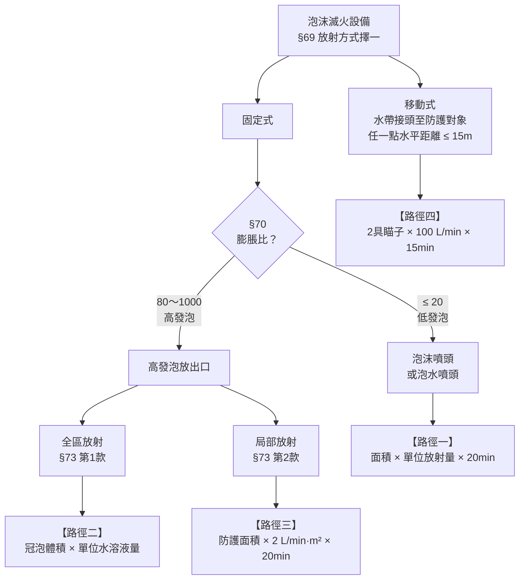
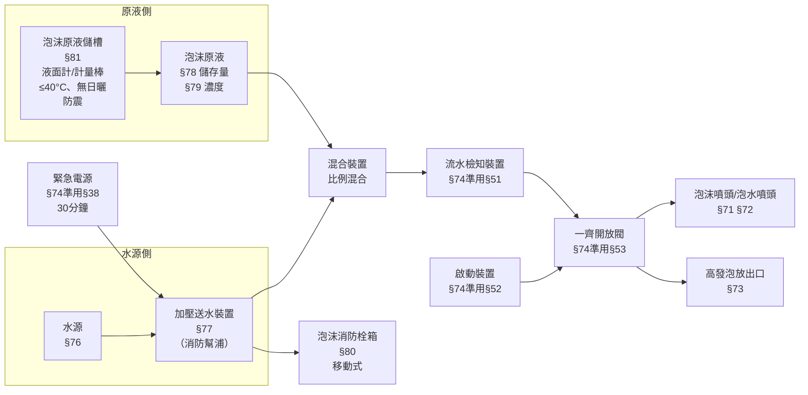

# 泡沫滅火設備 — 公式、計算流程與實例（§69～§81）

> 條文範圍：第三編 第一章 第五節，§69～§81，共 13 條。
> 版本：民國 113 年 4 月 24 日修正。
> 搭配圖解：`04a-泡沫設備-圖解.html`（用瀏覽器開啟）

---

## 〇、先建立全貌

泡沫設備最容易亂的地方在於：**它有四條完全不同的計算路徑**，用錯路徑數字就全錯。分岔點只有兩個——**膨脹比**和**放射方式**。



> ⚠️ **法規的空白區**：膨脹比 **20～80 之間**在 §70 沒有對應的放出口種類。實務上不會落在這個區間；命題時若出現「膨脹比 50」，那是陷阱。

**膨脹比定義（§70Ⅱ）**：

$$\text{膨脹比} = \frac{\text{泡沫發泡體積}}{\text{發泡所需泡沫水溶液體積}}$$

高發泡三種等級（§73 表）：

| 種別 | 膨脹比範圍 |
|---|---|
| **第一種** | 80 以上 250 未滿 |
| **第二種** | 250 以上 500 未滿 |
| **第三種** | 500 以上 1000 未滿 |

---

## 一、四條路徑的公式總表

### 路徑一：低發泡・固定式（泡沫頭）

| 步驟 | 公式 | 條 |
|---|---|---|
| ① 噴頭數量 | $n = \lceil A / a \rceil$ | §71 |
| ② 放射區域劃分 | 見下表 | §75 |
| ③ 該區放射量 | 泡沫噴頭：$Q = A_{區} \times q$<br>泡水噴頭：$Q = n_{區} \times 75$ | §72 |
| ④ 放射所需水溶液量 | $V_0 = Q \times 20\ \text{min}$ | §76Ⅰ① |
| ⑤ 總泡沫水溶液量 | $V = (V_0 + V_{配管}) \times 1.2$ | §76Ⅱ |
| ⑥ 原液儲存量 | $W = V \times C$ | §78、§79 |
| ⑦ 幫浦出水量 | 放射區域 ≥ 2 時：$Q_{幫浦} = Q_{最大區} \times 2$ | §77Ⅱ① |
| ⑧ 幫浦出水壓力 | 最末端一個放射區域**全部泡沫噴頭** ≥ **1 kgf/cm²（0.1 MPa）** | §77Ⅱ② |

**單位面積 a（§71）**

| 場所 | 噴頭種類 | 每幾 m² 設 1 個 |
|---|---|---|
| **飛機庫**等場所 | **泡水噴頭** | **8 m²** |
| **室內停車空間、汽車修理廠**等場所 | **泡沫噴頭** | **9 m²** |

另：**放射區域內任一點至泡沫噴頭之水平距離 ≤ 2.1 m**（§71③）。

**單位放射量 q（§72）**

| 泡沫原液種類 | 泡沫噴頭放射量（L/min·m²） |
|---|---:|
| **蛋白質泡沫液** | **≥ 6.5** |
| **合成界面活性泡沫液** | **≥ 8** |
| **水成膜泡沫液** | **≥ 3.7** |

**泡水噴頭放射量：每個 ≥ 75 L/min**（§72①）

**放射區域（§75）**

| 使用噴頭 | 放射區域規定 |
|---|---|
| **泡沫噴頭** | 每一放射區域 **50 m² 以上 100 m² 以下** |
| **泡水噴頭** | 放射區域占樓地板面積 **1/3 以上**，且**至少 200 m²**<br>（樓地板面積未達 200 m² 者，依實際樓地板面積計） |

---

### 路徑二：高發泡・全區放射

| 步驟 | 公式 | 條 |
|---|---|---|
| ① **冠泡體積** | $V_c = A \times (h + 0.5)$ | §73Ⅰ①（二） |
| ② 放射量 | $Q = V_c \times q_{高}$ | §73Ⅰ①（一） |
| ③ 放出口數量 | $N = \lceil A / 500 \rceil$，且每個附設**泡沫放出停止裝置** | §73Ⅰ①（三） |
| ④ 放射所需水溶液量 | $V_0 = V_c \times k$（**不乘時間**） | §76Ⅰ②（1） |
| ⑤ 開口部未設閉鎖裝置 | **加算開口洩漏泡沫水溶液量** | §76Ⅰ②（1） |
| ⑥ 總泡沫水溶液量 | $V = (V_0 + V_{開口洩漏} + V_{配管}) \times 1.2$ | §76Ⅱ |
| ⑦ 原液儲存量 | $W = V \times C$ | §78、§79 |

- $A$：防護區域樓地板面積（m²）
- $h$：防護對象**最高點**高度（m）
- **冠泡體積**：防護區域自**樓地板面**至**高出防護對象最高點 0.5 m** 所圍體積

**單位放射量 $q_高$（L/min·m³ 冠泡體積）（§73Ⅰ①）**

| 防護對象 | 第一種 | 第二種 | 第三種 |
|---|---:|---:|---:|
| **飛機庫** | **2** | **0.5** | **0.29** |
| **室內停車空間或汽車修護廠** | **1.11** | **0.28** | **0.16** |
| §18 表第八項之場所 ※ | 1.25 | 0.31 | 0.18 |

**單位水溶液量 $k$（m³ / m³ 冠泡體積）（§76Ⅰ②（1））**

| 膨脹比種類 | 每 1 m³ 冠泡體積之泡沫水溶液量 |
|---|---:|
| **第一種** | **0.04 m³** |
| **第二種** | **0.013 m³** |
| **第三種** | **0.008 m³** |

> ※ **法規瑕疵提醒**：現行 §18 附表只有**一～七項**（原第八項「引擎試驗室、石油試驗室、印刷機房」已刪除），但 §73 的表仍保留「第十八條表第八項之場所」這一列。這是修法未同步的**殘留引用**，實務上已無對應場所。若題目或設計案引用到，建議先向消防主管機關確認。

**全區放射的其他要件（§73Ⅰ）**
- 防護區域**開口部**能在泡沫水溶液放射前**自動關閉**；但能有效補充開口部洩漏者，得免設自動關閉裝置
- 高發泡放出口**位置高於防護對象物最高點**
- **防護對象位置距樓地板面高度超過 5 m，且使用高發泡放出口時，應為全區放射方式**

---

### 路徑三：高發泡・局部放射

| 步驟 | 公式 | 條 |
|---|---|---|
| ① 外推距離 | $d = \max(3H,\ 1)$（m） | §73Ⅱ③ |
| ② **防護面積** | 防護對象外周線各邊外推 $d$ 所包圍之面積 | §73Ⅱ③ |
| ③ 放射量 | $Q = A_p \times 2\ \text{L/min·m}^2$ | §73Ⅱ② |
| ④ 放射所需水溶液量 | $V_0 = Q \times 20\ \text{min}$ | §76Ⅰ②（2） |
| ⑤ 總泡沫水溶液量 | $V = (V_0 + V_{配管}) \times 1.2$ | §76Ⅱ |

- $H$：防護對象物**高度**（m）
- **⚠️ 3H 若小於 1 m，以 1 m 計**

**鄰接對象的合併規則（§73Ⅱ①）**
防護對象物相互鄰接，且鄰接處有延燒之虞時，**視為單一防護對象**設置高發泡放出口。
**但**該鄰接處以具**1 小時以上防火時效之牆壁**區劃，或**相距 3 m 以上**者，得免視為單一防護對象。

---

### 路徑四：移動式

| 步驟 | 公式／規定 | 條 |
|---|---|---|
| ① 同時使用支數 | $N = \min(\text{泡沫消防栓箱數},\ 2)$ | §80① |
| ② 瞄子放射量 | **≥ 100 L/min**（每具） | §80① |
| ③ 放射所需水溶液量 | $V_0 = N \times 100 \times \mathbf{15}\ \text{min}$ | §76Ⅰ③ |
| ④ 總泡沫水溶液量 | $V = (V_0 + V_{配管}) \times 1.2$ | §76Ⅱ |
| ⑤ 幫浦出水量 | 同層 **1 個**箱：**≥ 130 L/min**<br>同層 **2 個以上**箱：**≥ 260 L/min** | §77Ⅲ① |
| ⑥ 幫浦出水壓力 | 最末端一個泡沫消防栓 **≥ 3.5 kgf/cm²（0.35 MPa）** | §77Ⅲ② |

**移動式的硬性規定（§80）**
- **泡沫原液應使用低發泡**
- 水平距離：水帶接頭至防護對象任一點 **≤ 15 m**（§69②）
- 在**水帶接頭 3 m 範圍內**設置泡沫消防栓箱
- 箱內配置：**長 20 m 以上水帶**及**泡沫瞄子 1 具**
- **箱面表面積 ≥ 0.8 m²**，標明「**移動式泡沫滅火設備**」字樣
- 箱上方設置**紅色幫浦啟動表示燈**

> ⚠️ **移動式是全部水系設備裡唯一用「15 分鐘」的**，其餘一律 20 分鐘（室外消防栓 30 分鐘除外）。
> ⚠️ 注意 §76③ 的**瞄子放射量 100 L/min**（算水源用）與 §77Ⅲ① 的**幫浦出水量 130／260 L/min**（算幫浦用）是**兩組不同的數字**，前者算水量、後者算幫浦，不可混用。

---

## 二、§76 第 2 項的加算規則（最容易失分的地方）

> **原文**：「前項各款計算之水溶液量，**應加算充滿配管所需之泡沫水溶液量**，且**應加算總泡沫水溶液量之百分之二十**。」

也就是說，前面四條路徑算出來的都只是「**放射所需量**」，還要再做兩次加算：

```
        放射所需水溶液量  V₀
      + 充滿配管所需量    V_配管
      ─────────────────────────
      = 小計
      + 小計 × 20%
      ─────────────────────────
      = 總泡沫水溶液量    V
```

$$\boxed{V = (V_0 + V_{配管}) \times 1.2}$$

> 📌 **條文用語的模糊點**：「總泡沫水溶液量之百分之二十」中的「總泡沫水溶液量」究竟指「$V_0$」「$V_0 + V_{配管}$」還是「最終總量 $V$」，文義上不明確。
> 實務與多數教材採**「$(V_0 + V_{配管}) \times 1.2$」**。若採第三種解讀（20% 是最終總量的兩成，即 $V = (V_0+V_{配管})/0.8 = \times 1.25$），數字會偏大。
> **設計送審前建議向當地消防機關確認採用哪一種**。本筆記全部採 ×1.2。

**原液量（§78、§79）**

$$W = V \times C$$

| 泡沫原液種類 | 可用濃度 C |
|---|---|
| **蛋白質泡沫液** | **3% 或 6%** |
| **合成界面活性泡沫液** | **1% 或 3%** |
| **水成膜泡沫液** | **3% 或 6%** |

> 💡 記法：**只有合成界面活性有 1%**；蛋白質與水成膜都是 **3/6**。

---

## 三、實例演算

> 以下五例均假設 $V_{配管}$ 另計（實務依配管長度與管徑核算），列式時保留該項。

---

### 例一｜室內停車空間・低發泡固定式（泡沫噴頭）

**條件**
- 地下一層室內停車空間，樓地板面積 $A = 1{,}200\ \text{m}^2$
- 採**水成膜泡沫液，濃度 3%**
- 車輛採多列停放（不適用 §18 附表註三之免除）

**Step 0　應設判斷**
§18 附表項目三：室內停車空間**在地下層**樓地板面積 **≥ 200 m²** → 1,200 m² 已達，**應設**。
可選：水霧／泡沫／CO₂或惰性氣體／鹵化烴／乾粉。本例選**泡沫**。
（另依 §17Ⅱ，設泡沫後在有效範圍內得免設自動撒水；依 §15Ⅱ，亦得免設室內消防栓。）

**Step 1　噴頭數量（§71②）**
$$n = \lceil 1200 / 9 \rceil = \lceil 133.3 \rceil = \mathbf{134\ 個}$$
並須確認放射區域內任一點至泡沫噴頭水平距離 ≤ 2.1 m。

**Step 2　放射區域劃分（§75①）**
每一放射區域 50～100 m²，取上限 **100 m²**：
$$\text{放射區域數} = 1200 / 100 = \mathbf{12\ 區}$$
每區噴頭數 $= \lceil 100/9 \rceil = 12$ 個。

**Step 3　最大一個放射區域之放射量（§72②）**
水成膜 → $q = 3.7\ \text{L/min·m}^2$
$$Q = 100 \times 3.7 = \mathbf{370\ L/min}$$

**Step 4　放射所需水溶液量（§76Ⅰ①）**
$$V_0 = 370 \times 20 = 7{,}400\ \text{L} = \mathbf{7.4\ m}^3$$

**Step 5　總泡沫水溶液量（§76Ⅱ）**
$$V = (7.4 + V_{配管}) \times 1.2 \ \geq\ \mathbf{8.88\ m}^3$$

**Step 6　原液儲存量（§78、§79③）**
$$W = 8.88 \times 3\% = 0.266\ \text{m}^3 = \mathbf{約\ 266\ L}$$

**Step 7　加壓送水裝置（§77Ⅱ）**
放射區域 12 區（≥ 2）→ 出水量加倍：
$$Q_{幫浦} = 370 \times 2 = \mathbf{740\ L/min}$$
出水壓力：最末端一個放射區域**全部泡沫噴頭** ≥ **1 kgf/cm²（0.1 MPa）**，並連接緊急電源。

**答案整理**

| 項目 | 數值 |
|---|---|
| 泡沫噴頭 | 134 個（每區 12 個 × 12 區） |
| 放射區域 | 100 m² × 12 區 |
| 最大區放射量 | 370 L/min |
| 總泡沫水溶液量 | ≥ 8.88 m³（另加配管量） |
| 原液儲存量 | 約 266 L（水成膜 3%） |
| 幫浦出水量 | ≥ 740 L/min |
| 幫浦出水壓力 | ≥ 1 kgf/cm² |

> 💡 **換原液種類會怎樣？**（其餘條件不變）
> | 原液 | q | Q | V₀ | V | 原液量（3%） |
> |---|---:|---:|---:|---:|---:|
> | 水成膜 | 3.7 | 370 | 7.4 m³ | 8.88 m³ | 266 L |
> | 蛋白質 | 6.5 | 650 | 13.0 m³ | 15.6 m³ | 468 L |
> | 合成界面活性 | 8.0 | 800 | 16.0 m³ | 19.2 m³ | 576 L |
>
> **水成膜的放射量最低（滅火效率最高），水源與原液量都最省。**這就是實務上停車場多用 AFFF 的原因。

---

### 例二｜室內停車空間・高發泡全區放射

**條件**
- 室內停車空間，樓地板面積 $A = 600\ \text{m}^2$
- 天花板高度 4 m，**防護對象（車輛）最高點 $h = 1.8\ \text{m}$**
- 採**第二種**高發泡（膨脹比 250 以上 500 未滿）
- 開口部**已設**自動關閉裝置
- 原液採**合成界面活性泡沫液，濃度 3%**

**Step 1　冠泡體積（§73Ⅰ①（二））**
$$V_c = A \times (h + 0.5) = 600 \times (1.8 + 0.5) = 600 \times 2.3 = \mathbf{1{,}380\ m}^3$$

```
       ┌─────────────────────────────┐  ← 天花板 4.0 m
       │                             │
   ╌╌╌╌┼─────────────────────────────┼╌╌╌╌  冠泡上緣 2.3 m
       │      ↑ 0.5 m（法定加高）      │
       │  ┌────────┐   ┌────────┐    │  ← 車輛最高點 1.8 m
       │  │  車輛   │   │  車輛   │    │
       └──┴────────┴───┴────────┴────┘  ← 樓地板面 0 m
       ←──────── A = 600 m² ─────────→
              冠泡體積 = 600 × 2.3 = 1,380 m³
```

**Step 2　放射量（§73Ⅰ①（一））**
室內停車空間 × 第二種 → $q_高 = 0.28\ \text{L/min·m}^3$
$$Q = 1380 \times 0.28 = \mathbf{386.4\ L/min}$$

**Step 3　放出口數量（§73Ⅰ①（三））**
每 500 m² 至少 1 個：
$$N = \lceil 600 / 500 \rceil = \mathbf{2\ 個}$$
每個附設**泡沫放出停止裝置**，且**位置高於防護對象最高點（1.8 m）**。

**Step 4　放射所需水溶液量（§76Ⅰ②（1））**
第二種 → $k = 0.013\ \text{m}^3/\text{m}^3$
$$V_0 = 1380 \times 0.013 = \mathbf{17.94\ m}^3$$

> ⚠️ **這裡不乘 20 分鐘。** 高發泡全區放射的水源是「灌滿冠泡體積所需的水溶液量」，本質是**體積比**，不是時間積。這是路徑二與其他三條路徑最大的差異，也是最常見的錯誤。

**Step 5　總泡沫水溶液量（§76Ⅱ）**
開口部已設自動關閉裝置 → 免加算洩漏量。
$$V = (17.94 + V_{配管}) \times 1.2\ \geq\ \mathbf{21.53\ m}^3$$

**Step 6　原液儲存量**
$$W = 21.53 \times 3\% = 0.646\ \text{m}^3 = \mathbf{約\ 646\ L}$$

**答案整理**

| 項目 | 數值 |
|---|---|
| 冠泡體積 | 1,380 m³ |
| 放射量 | 386.4 L/min |
| 高發泡放出口 | 2 個 |
| 總泡沫水溶液量 | ≥ 21.53 m³（另加配管量） |
| 原液儲存量 | 約 646 L（合成界面活性 3%） |

> 💡 **膨脹比越高越省水**：同樣 1,380 m³ 冠泡體積
> | 種類 | k | V₀ |
> |---|---:|---:|
> | 第一種（80～250） | 0.04 | 55.2 m³ |
> | 第二種（250～500） | 0.013 | 17.94 m³ |
> | 第三種（500～1000） | 0.008 | 11.04 m³ |
>
> 膨脹比從第一種提到第三種，水量降到約 1/5——**高發泡的價值就在這裡**。

---

### 例三｜汽車修理廠・移動式

**條件**
- 汽車修理廠第一層，樓地板面積 700 m²
- **外牆常時開放之開口面積達該層樓地板面積 15% 以上** → 依 §18Ⅰ但書得採**移動式**
- 設置**泡沫消防栓箱 3 個**
- 原液採**蛋白質泡沫液，濃度 3%**

**Step 0　應設與移動式適格**
§18 附表項目三：汽車修理廠**第 1 層 ≥ 500 m²** → 700 m² 已達，應設。
§18Ⅰ但書：常時開放開口 ≥ 15% → **除惰性氣體及鹵化烴外**得採移動式 → 泡沫可採移動式。

**Step 1　同時使用支數（§80①）**
泡沫消防栓箱 3 個 > 2 → 以**同時使用 2 支**計算。
$$N = 2$$

**Step 2　放射量**
$$Q = 2 \times 100 = \mathbf{200\ L/min}$$

**Step 3　放射所需水溶液量（§76Ⅰ③）**
**時間為 15 分鐘**：
$$V_0 = 200 \times 15 = 3{,}000\ \text{L} = \mathbf{3.0\ m}^3$$

**Step 4　總泡沫水溶液量（§76Ⅱ）**
$$V = (3.0 + V_{配管}) \times 1.2\ \geq\ \mathbf{3.6\ m}^3$$

**Step 5　原液儲存量**
$$W = 3.6 \times 3\% = 0.108\ \text{m}^3 = \mathbf{108\ L}$$

**Step 6　加壓送水裝置（§77Ⅲ）**
同一樓層設 2 個以上泡沫消防栓箱 →
$$Q_{幫浦} \geq \mathbf{260\ L/min}$$
出水壓力：最末端一個泡沫消防栓 **≥ 3.5 kgf/cm²（0.35 MPa）**，並連接緊急電源。

**Step 7　配置檢核（§69②、§80④）**
- 水帶接頭至防護對象任一點水平距離 **≤ 15 m**
- 泡沫消防栓箱設於水帶接頭 **3 m 範圍內**
- 箱內：**長 20 m 以上水帶** + 泡沫瞄子 1 具
- 箱面表面積 **≥ 0.8 m²**，標明「移動式泡沫滅火設備」
- 箱上方設**紅色幫浦啟動表示燈**
- 原液**限低發泡**

> ⚠️ **本例最大的陷阱**：Step 2 的 200 L/min 是**算水源用的瞄子放射量**；Step 6 的 260 L/min 是**幫浦出水量的法定下限**。兩者不是同一件事，也不互相取代——幫浦要同時滿足「輸出 ≥ 260 L/min」和「水源撐得住 15 分鐘」。

---

### 例四｜高發泡・局部放射

**條件**
- 防護對象物：長 6 m × 寬 4 m × **高 0.8 m** 之機具
- 四周無鄰接對象（不適用 §73Ⅱ① 合併規則）

**Step 1　外推距離（§73Ⅱ③）**
$$3H = 3 \times 0.8 = 2.4\ \text{m}$$
$2.4 \geq 1$ → 取 $d = \mathbf{2.4\ m}$

**Step 2　防護面積**
$$A_p = (6 + 2 \times 2.4) \times (4 + 2 \times 2.4) = 10.8 \times 8.8 = \mathbf{95.04\ m}^2$$

```
   ←─────────── 10.8 m ───────────→
   ┌───────────────────────────────┐  ┬
   │ ←2.4→                         │  │
   │      ┌───────────────┐        │  │
   │      │               │        │  │
   │      │   防護對象     │ 4 m    │ 8.8 m
   │      │   6 m × 4 m   │        │  │
   │      │   H = 0.8 m   │        │  │
   │      └───────────────┘        │  │
   │                         ←2.4→ │  │
   └───────────────────────────────┘  ┴
        防護面積 = 10.8 × 8.8 = 95.04 m²
        外推距離 d = 3H = 2.4 m（≥1 m，故取 2.4）
```

**Step 3　放射量（§73Ⅱ②）**
$$Q = 95.04 \times 2 = \mathbf{190.08\ L/min}$$

**Step 4　放射所需水溶液量（§76Ⅰ②（2））**
**局部放射要乘 20 分鐘**（與全區放射不同）：
$$V_0 = 190.08 \times 20 = 3{,}801.6\ \text{L} \approx \mathbf{3.80\ m}^3$$

**Step 5　總泡沫水溶液量**
$$V = (3.80 + V_{配管}) \times 1.2\ \geq\ \mathbf{4.56\ m}^3$$

> 💡 **對照練習**：若機具高度改為 **0.3 m**
> $3H = 0.9 < 1$ → **取 d = 1 m**（不是 0.9）
> $A_p = (6+2) \times (4+2) = 8 \times 6 = 48\ \text{m}^2$
> $Q = 48 \times 2 = 96\ \text{L/min}$，$V_0 = 1.92\ \text{m}^3$
> **矮的東西反而不會無限縮小防護面積——這就是 1 m 下限的用意。**

---

### 例五｜飛機庫・低發泡固定式（泡水噴頭）

**條件**
- 飛機庫，樓地板面積 $A = 900\ \text{m}^2$
- 使用**泡水噴頭**
- 原液採**水成膜泡沫液，濃度 3%**

**Step 0　應設判斷**
§18 附表項目二：飛機修理廠、飛機庫樓地板面積 **≥ 200 m²** → 應設。
可選：**泡沫**或**乾粉**（項目二只有這兩欄有○）。

**Step 1　噴頭數量（§71①）**
飛機庫用**泡水噴頭，每 8 m² 設 1 個**：
$$n = \lceil 900 / 8 \rceil = \lceil 112.5 \rceil = \mathbf{113\ 個}$$

**Step 2　放射區域（§75②）**
泡水噴頭：放射區域占樓地板面積 **1/3 以上**且**至少 200 m²**
$$900 / 3 = 300\ \text{m}^2 \geq 200\ \text{m}^2 \ \Rightarrow\ A_{區} = \mathbf{300\ m}^2$$
該區噴頭數 $= \lceil 300/8 \rceil = \mathbf{38\ 個}$，放射區域數 $= 900/300 = 3$ 區。

**Step 3　放射量（§72①）**
泡水噴頭每個 **≥ 75 L/min**：
$$Q = 38 \times 75 = \mathbf{2{,}850\ L/min}$$

> ⚠️ 泡水噴頭算的是「**個數 × 75**」，**不是**「面積 × 單位放射量」。§72 的 6.5／8／3.7 那張表只適用**泡沫噴頭**。

**Step 4　放射所需水溶液量**
$$V_0 = 2850 \times 20 = 57{,}000\ \text{L} = \mathbf{57\ m}^3$$

**Step 5　總泡沫水溶液量**
$$V = (57 + V_{配管}) \times 1.2\ \geq\ \mathbf{68.4\ m}^3$$

**Step 6　原液儲存量**
$$W = 68.4 \times 3\% = 2.052\ \text{m}^3 = \mathbf{約\ 2{,}052\ L}$$

**Step 7　幫浦出水量**
放射區域 3 區（≥ 2）→ 加倍：
$$Q_{幫浦} = 2850 \times 2 = \mathbf{5{,}700\ L/min}$$

> 💡 跟例一比較：同樣低發泡固定式，飛機庫因為**放射區域大（300 m² vs 100 m²）＋泡水噴頭放射量高（75 L/min/個）**，水量差了將近 8 倍。**放射區域的劃分方式，是整個泡沫系統規模的決定因素。**

---

## 四、系統組成與準用關係



### §74 準用一覽（背這條可省下 6 條的記憶量）

> 泡沫滅火設備之**緊急電源、配管、配件、屋頂水箱、竣工時之加壓試驗、流水檢知裝置、啟動裝置及一齊開放閥**，準用下列規定：

| 準用條 | 內容 | 關鍵數字 |
|---|---|---|
| **§38** | 緊急電源 | 發電機或蓄電池，**30 分鐘**以上 |
| **§44** | 配管、配件、屋頂水箱（再準用 §32Ⅰ、Ⅱ） | 立管連接屋頂水箱時，水箱容量 **≥ 1 m³**；乾式／預動式二次側配管支管每 10 m 傾斜 4 cm、主管每 10 m 傾斜 2 cm |
| **§45** | 竣工加壓試驗（再準用 §33） | 試驗壓力 ≥ 全閉揚程 **1.5 倍**，**持續 2 小時**無漏水 |
| **§51** | 流水檢知裝置 | 樓地板面積 **≤ 3,000 m²** 裝 1 套，超過裝 2 套（無隔間得增為 10,000 m²）；制水閥高度 **0.8～1.5 m** |
| **§52** | 啟動裝置 | 感知撒水頭標示溫度 **≤ 79°C**，每 **20 m²** 1 個，裝置面距樓地板 **≤ 5 m**；手動啟動開關每一放水區域 1 個，高度 **0.8～1.5 m** |
| **§53** | 一齊開放閥 | 每一放水區域 **1 個**；二次側配管裝設試驗用裝置 |

> 💡 **§74 沒有準用 §58**（加壓送水裝置），因為泡沫的加壓送水裝置在 **§77** 自己另有規定。這是常見的誤答點。

### 泡沫原液儲槽（§81）— 四項要求

1. 設有便於確認藥劑量之**液面計或計量棒**
2. **平時在加壓狀態**者，應附設**壓力表**
3. 設置於**溫度 40°C 以下**，且**無日光曝曬**之處
4. 採取有效**防震**措施

---

## 五、共用配管的特別規定（§77Ⅳ）

> 同一棟建築物內，採用**低發泡原液**，分層配置**固定式及移動式**放射方式泡沫滅火設備時：
> **得共用配管及消防幫浦**，而**幫浦之出水量、揚程與泡沫原液儲存量應採其放射方式中較大者**。

**三個前提缺一不可：**
① 同一棟建築物內　② 採用**低發泡**原液　③ 分層配置固定式**及**移動式

**共用後怎麼取值：**

| 項目 | 取值方式 |
|---|---|
| 幫浦出水量 | 兩種放射方式中**較大者** |
| 揚程 | 兩種放射方式中**較大者** |
| 泡沫原液儲存量 | 兩種放射方式中**較大者** |

> 以例一（固定式 740 L/min、原液 266 L）與例三（移動式 260 L/min、原液 108 L）為例，若在同一棟分層配置且皆為低發泡：
> 幫浦出水量取 **740 L/min**，原液儲存量取 **266 L**。**不是相加。**

---

## 六、易錯點總清單

| # | 陷阱 | 正解 |
|:--:|---|---|
| 1 | 高發泡**全區**放射的水源乘 20 分鐘 | ❌ **不乘時間**，是 $V_c \times k$（體積比） |
| 2 | 高發泡**局部**放射的水源不乘時間 | ❌ **要乘 20 分鐘** |
| 3 | 移動式用 20 分鐘 | ❌ **15 分鐘** |
| 4 | 泡水噴頭用 §72 的 6.5／8／3.7 | ❌ 那是**泡沫噴頭**專用；泡水噴頭是**每個 75 L/min** |
| 5 | 冠泡體積用**天花板高度** | ❌ 用「**防護對象最高點 + 0.5 m**」 |
| 6 | 局部放射 3H < 1 m 時用 3H | ❌ **以 1 m 計** |
| 7 | 移動式水源用幫浦出水量 130／260 算 | ❌ 水源用**瞄子放射量 100 L/min**；130／260 是幫浦下限 |
| 8 | 忘記 §76Ⅱ 的「配管量 + 20%」 | 算完 $V_0$ 一定要再 **×1.2** |
| 9 | 原液量用 $V_0$ 乘濃度 | 應用**加算後的總量 $V$** 乘濃度 |
| 10 | 幫浦出水量沒加倍 | 放射區域 **≥ 2** 時要 **×2**（§77Ⅱ①） |
| 11 | 泡沫噴頭放射區域用 9 m² 上限 | 9 m² 是**每個噴頭的面積**；放射區域是 **50～100 m²** |
| 12 | 泡水噴頭放射區域也用 50～100 m² | 泡水噴頭是 **≥1/3 樓地板面積且至少 200 m²** |
| 13 | 共用配管時把兩種方式的原液量相加 | **取較大者**，不是相加 |
| 14 | 高發泡放出口每 100 m² 一個 | **每 500 m² 至少一個** |
| 15 | 認為 §74 準用 §58 | §74 準用的是 §38、§44、§45、§51～§53；加壓送水裝置在 **§77** |

---

## 七、條文原文對照索引

| 條 | 主題 | 本筆記章節 |
|---|---|---|
| §69 | 放射方式（固定式／移動式）；移動式水平距離 15 m | 〇 |
| §70 | 膨脹比與放出口種類對照；膨脹比定義 | 〇 |
| §71 | 泡沫頭配置（8 m²／9 m²／2.1 m／複層式停車） | 路徑一 |
| §72 | 泡沫頭放射量（75 L/min；6.5／8／3.7） | 路徑一 |
| §73 | 高發泡放出口（全區／局部；冠泡體積；500 m²；3H） | 路徑二、三 |
| §74 | 準用 §38、§44、§45、§51～§53 | 四 |
| §75 | 放射區域（50～100 m²；1/3 且 ≥200 m²） | 路徑一 |
| §76 | **水源**（20 min／體積比／15 min；配管＋20%） | 路徑一～四、二 |
| §77 | **加壓送水裝置**（出水量加倍；1 kgf/cm²；130／260；3.5 kgf/cm²；共用配管） | 路徑一、四、五 |
| §78 | 原液儲存量 = 水量 × 濃度比 | 二 |
| §79 | 濃度（3/6；1/3；3/6） | 二 |
| §80 | 移動式（100 L/min；3.5 kgf/cm²；低發泡；箱體規格） | 路徑四 |
| §81 | 泡沫原液儲槽（液面計；壓力表；40°C；防震） | 四 |

線上原文：https://law.moj.gov.tw/LawClass/LawAll.aspx?pcode=D0120029

---

## 八、自我檢測

1. 某室內停車空間 800 m²，採合成界面活性泡沫液 3%、泡沫噴頭，放射區域取 100 m²。求最大區放射量、總泡沫水溶液量（不計配管）、原液儲存量、幫浦出水量。
2. 飛機庫採第一種高發泡全區放射，樓地板面積 1,000 m²，防護對象最高點 2.5 m。求冠泡體積、放射量、放出口數量、放射所需水溶液量。
3. 某防護對象 5 m × 5 m × 高 0.25 m，採高發泡局部放射。求防護面積與放射量。
4. 移動式泡沫設備，某樓層設 1 個泡沫消防栓箱。求水源容量（不計配管）與幫浦出水量下限。
5. 為什麼高發泡全區放射的水源計算不乘時間？

<details>
<summary>參考答案</summary>

**1.**
- 放射量：$Q = 100 \times 8 = 800\ \text{L/min}$
- $V_0 = 800 \times 20 = 16{,}000\ \text{L} = 16\ \text{m}^3$
- $V = 16 \times 1.2 = 19.2\ \text{m}^3$
- 原液：$19.2 \times 3\% = 0.576\ \text{m}^3 = 576\ \text{L}$
- 放射區域數 $= 800/100 = 8$ 區（≥2）→ 幫浦出水量 $= 800 \times 2 = 1{,}600\ \text{L/min}$
（另：噴頭數 $= \lceil 800/9 \rceil = 89$ 個）

**2.**
- 冠泡體積：$V_c = 1000 \times (2.5+0.5) = 3{,}000\ \text{m}^3$
- 放射量：飛機庫第一種 $q_高 = 2$ → $Q = 3000 \times 2 = 6{,}000\ \text{L/min}$
- 放出口數：$\lceil 1000/500 \rceil = 2$ 個
- 水溶液量：第一種 $k = 0.04$ → $V_0 = 3000 \times 0.04 = 120\ \text{m}^3$
（加算後 $V = 120 \times 1.2 = 144\ \text{m}^3$，另加配管量）

**3.**
- $3H = 3 \times 0.25 = 0.75 < 1$ → **取 d = 1 m**
- $A_p = (5+2) \times (5+2) = 49\ \text{m}^2$
- $Q = 49 \times 2 = 98\ \text{L/min}$

**4.**
- 箱數 1 個 → $N = 1$，$Q = 1 \times 100 = 100\ \text{L/min}$
- $V_0 = 100 \times 15 = 1{,}500\ \text{L} = 1.5\ \text{m}^3$；$V = 1.5 \times 1.2 = 1.8\ \text{m}^3$
- 幫浦出水量：同一樓層設 1 個泡沫消防栓箱 → **≥ 130 L/min**

**5.** 高發泡全區放射的滅火機制是**用泡沫把整個防護區域灌滿到冠泡高度**（窒息＋冷卻），成敗取決於「灌不灌得滿」，所以水源需求是由**冠泡體積 × 單位體積所需水溶液量**這個體積比決定的，與放射時間無關。§73 的放射量表（L/min·m³）另外規範「多快灌滿」，兩者是不同維度：一個管**總量**，一個管**速率**。
其餘三條路徑（低發泡固定式、高發泡局部放射、移動式）的滅火機制是**持續覆蓋燃燒面**，所以水源是「放射量 × 持續時間」。
</details>
