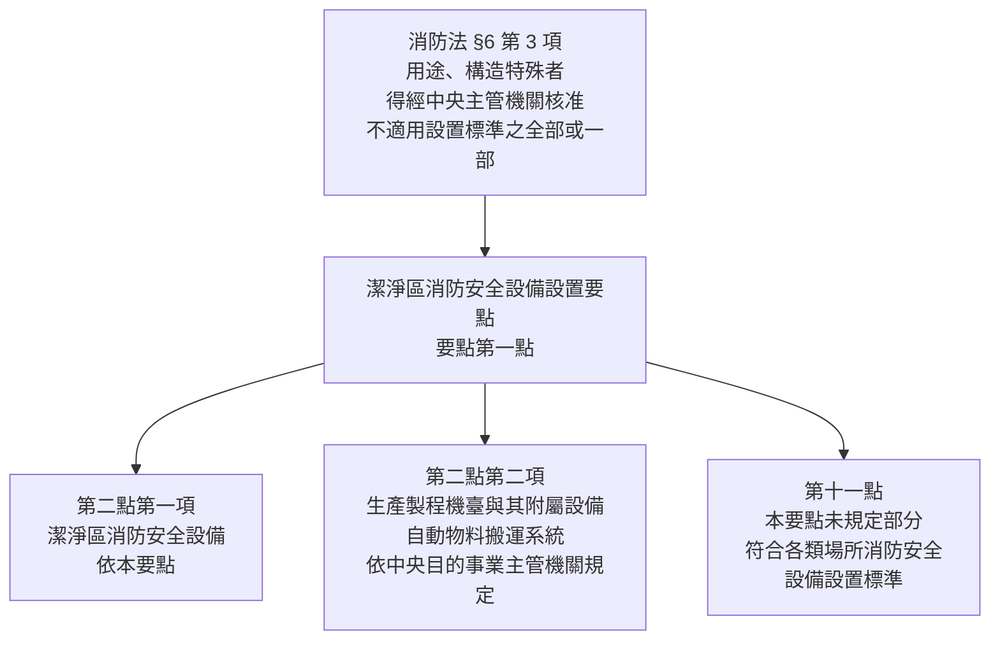
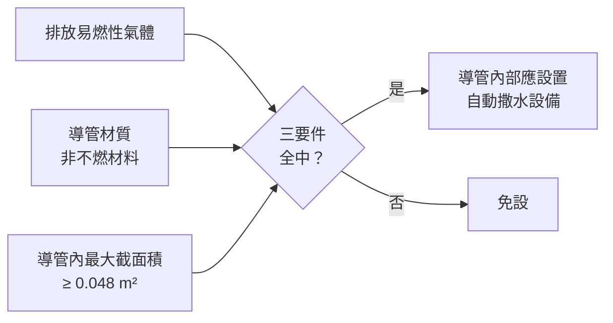

# 潔淨區消防安全設備 — 要點結構、公式與實例（要點一～十一）

> 法規：**潔淨區消防安全設備設置要點**（內政部消防署）
> 版本：民國 **115 年 4 月 8 日**修正，發布文號 內授消字第1150400553號
> 條文來源：[消防法令查詢系統 LSID=FL082558](https://law.nfa.gov.tw/mobile/law.aspx?LSID=FL082558)　·　[內政部主管法規共用系統 GL000940](https://glrs.moi.gov.tw/LawContent.aspx?id=GL000940)
> 擷取核對日：2026-08-07（該站法規資料更新日期：115/07/31）
> 搭配圖解：`14a-潔淨區消防安全設備-圖解.html`（用瀏覽器開啟）

---

## 〇、先破一個迷思

**這份要點裡沒有「氣體滅火設備」。**

半導體無塵室怕水，所以一定是海龍替代品或 CO₂ 全區放射——這是常見的直覺，但翻遍要點全十一點：

- 潔淨室的滅火主力是**密閉濕式自動撒水設備**（第六點）
- 唯一入法的「氣體」是第四點的**二氧化碳滅火器**，那是**可攜式滅火器**，不是固定式氣體滅火設備
- 機臺內建的滅火系統被第二點第二項明文推給**中央目的事業主管機關**，不在本要點管轄
- 第十點反而是一條**「准許把氣體換成水」**的授權（詳見第七節）

完整的四層分析見〈七、氣體滅火在潔淨區的定位〉。

---

## 一、法源與三條界線（第一點、第二點、第十一點）

### 法源鏈

### 適用對象：六類電子工業（第一點第二項）

| # | 業別 |
|:---:|---|
| ① | 積體電路製造業 |
| ② | 半導體封裝及測試業 |
| ③ | 液晶面板及組件製造業 |
| ④ | 發光二極體製造業 |
| ⑤ | 太陽能電池製造業 |
| ⑥ | 其他經**中央主管機關認定**之業別 |

> 💡 要點是**補充＋鬆綁**，不是取代。要點只寫了七種設備（滅火器、室內消防栓、自動撒水、手動報警、火警自動警報／吸氣式偵煙、標示設備、排煙）；避難器具、緊急照明、連結送水管、消防專用蓄水池等一概回到設置標準。

---

## 二、用語定義（第三點）— 十一款

| 款 | 用語 | 原文定義 |
|:---:|---|---|
| ① | **潔淨區**（Clean Zone） | 空氣中粒子濃度控制符合 ISO 14644 號規範**等級 1 至等級 9** 之區域 |
| ② | **潔淨室**（Cleanroom） | 潔淨區內設置**主要生產機臺與其附屬設備**之區域 |
| ③ | **上回風層**（Air Plenum） | 潔淨室**上方**層 |
| ④ | **下回風層**（Return Air Plenum） | 潔淨室**下方**層 |
| ⑤ | **回風豎井**（Return Air Shaft） | 維持潔淨空氣所需循環氣流之**垂直通道** |
| ⑥ | **冷卻乾盤管**（Dry Cooling Coil） | 調整、控制循環氣流溫度及濕度之設備 |
| ⑦ | **格子樓板**（Waffle Slab） | 為達潔淨區氣流循環目的而具**開口**之樓板 |
| ⑧ | **風機過濾機組**（Fan Filter Unit） | HEPA/ULPA 與風機組合，提供空氣淨化的**末端裝置** |
| ⑨ | **氣淋室**（Air Shower） | 利用高速潔淨氣流吹落並清除進入潔淨室人員、物料表面附著粒子之區域 |
| ⑩ | **管橋**（Bridge） | 因應生產製造作業連續性之需，**連通兩棟建築物**之通道 |
| ⑪ | **自動物料搬運系統**（AMHS） | 軌道、升降設備將物料儲放於 Stocker／Tower Stocker 內之運輸系統 |

> ⚠️ **「潔淨區」與「潔淨室」是兩個不同的詞，不能互換。**
> 第四、五、七、八點寫「**潔淨室**」；第九點寫「**潔淨區**」。範圍差很多，讀條文要盯緊。

---

## 三、設備 × 空間對照矩陣（第四點～第八點）

| 設備 | 潔淨室 | 上回風層 | 下回風層 | 回風豎井 | 管橋 | 氣淋室 | 條 |
|---|:---:|:---:|:---:|:---:|:---:|:---:|---|
| 二氧化碳滅火器 | ✓ | — | ✓ | — | ✓ | — | 四 |
| 室內消防栓設備 | ✓ | — | ✓ | — | ✓ | — | 五 |
| 密閉濕式自動撒水 | ✓ | ✓ | ✓ | **限頂部** | — | **得免設撒水頭** | 六Ⅰ |
| 手動報警設備 | ✓ | — | ✓ | — | ✓ | — | 七Ⅰ |
| 火警自動警報**或**吸氣式偵煙 | ✓ | ✓ | ✓ | **應設吸氣式** | ✓ | — | 七Ⅱ |
| 標示設備 | ✓ | — | ✓ | — | ✓ | — | 八Ⅰ |

**「—」表示要點未課予義務，仍受第十一點準用設置標準之拘束。**

### 三個記憶鉤

1. **三劍客**：潔淨室、下回風層、管橋——六項設備全設。因為這三處**人會進去**，所以滅火器、消防栓、手動報警、標示設備才有意義。
2. **兩條氣流通道**：上回風層、回風豎井——只有**撒水與偵測**。人不進去，但火照樣會燒。
3. **回風豎井有兩個特殊待遇**：撒水**限頂部**；偵測**應設吸氣式**（沒有二擇一的空間，因為豎井氣流速度高，傳統偵煙式來不及動作）。

### 標示設備的減光條款（第八點第二項）

> 標示設備因生產製程**色溫、光線**之特殊需求，與火警自動警報設備或吸氣式偵煙探測系統設有**連動亮燈**者，得予以**減光或消燈**。

黃光區不能有雜光，所以允許平時減光／消燈——但前提是**必須連動亮燈**。

---

## 四、自動撒水設備（第六點）— 主力設備

### 4-1　第一項：潔淨室・上回風層・下回風層・回風豎井頂部

**系統型式：密閉濕式**

| 款 | 規定 | 數值 |
|:---:|---|---|
| ① | 撒水頭感度 | **快速反應型（第一種感度）**——沒有一般反應型的選項 |
| ② | 撒水密度 | **≥ 8.15 L/min/m²**（計算方式由中央消防主管機關**另定**） |
| ③ | 水源容量 | 最遠 **30** 個撒水頭連續放射 **60 分鐘**；未達 30 個者依實際頭數計算 |
| ④ | 撒水頭位置 | 依設置標準 §47、§211Ⅰ⑤；但因製程機臺／附屬設備／配管／AMHS 需要，**不受 §47Ⅰ②④⑧ 及 §211Ⅰ⑤但書之限制** |
| ⑤ | 流水檢知裝置 | 分層設置有困難者，具備有效隔離、控制與監測各層放水區域之水流及警報時，**得集中設置** |
| ⑥ | 圖面資料 | 採集中設置者，應於附近明顯處備有**識別流水檢知裝置分區之圖面資料** |
| ⑦ | 氣淋室 | **得免設撒水頭** |

**第④款鬆綁的具體內容**（對照設置標準）：

| 設置標準 | 一般場所規定 | 潔淨區 |
|---|---|---|
| §47Ⅰ② | 密閉式迴水板與裝置面間距 ≤ **30 cm** | 得放寬 |
| §47Ⅰ④ | 裝置於樑下時，迴水板與樑底間距 ≤ **10 cm** | 得放寬 |
| §47Ⅰ⑧ | 防護板規定（迴水板與天花板距離 > 30 cm 時設置） | 不受限制 |
| §211Ⅰ⑤但書 | 公共危險物品場所撒水頭裝置面規定 | 不受限制 |

> 💡 條文明寫的鬆綁值：「撒水頭之迴水板裝置於**裝置面下方間距三十公分**或**樑下方間距十公分以下**」——也就是准許超過 §47 原本的上限。

### 4-2　放水量的推算

要點只給密度，設置標準只給單頭放水量，**兩者同時適用，取嚴者**：

$$q_{密度} = 8.15 \times A_{單頭防護面積}$$

$$q_{採用} = \max(q_{密度},\ 80\ \text{L/min})$$

$$V = N \times q_{採用} \times 60\ \text{min}\qquad(N = \min(30,\ 實設頭數))$$

**臨界防護面積**：

$$A_{臨界} = \frac{80}{8.15} \approx 9.82\ \text{m}^2\quad(\approx 3.13\ \text{m} \times 3.13\ \text{m})$$

- $A < 9.82\ \text{m}^2$ → 由設置標準 §50 的 **80 L/min** 控制
- $A > 9.82\ \text{m}^2$ → 由要點的 **8.15 密度**控制

> ⚠️ **此推算方式不是要點明文。** 要點第六點第一項第二款明定「其計算方式由中央消防主管機關另定之」。本筆記採實務通行的「密度 × 單頭防護面積，再與 §50 取嚴者」，送審前請向當地消防機關確認。

---

### 實例 1　潔淨室撒水頭放水量與水源容量

**已知**：撒水頭 3.0 m × 3.0 m 正方形配置，單頭防護面積 $A = 9.0\ \text{m}^2$。

| 步驟 | 計算 |
|---|---|
| ① 密度求放水量 | $q_{密度} = 8.15 \times 9.0 = 73.35$ L/min |
| ② 與 §50 比較 | $73.35 < 80$ → 取 **80 L/min** |
| ③ 水源容量 | $V = 30 \times 80 \times 60 = 144{,}000$ L |

**答：單頭放水量 80 L/min；水源容量 144 m³**

> 📊 **對照**：同樣 30 個頭，設置標準一般場所是 20 分鐘（§57），水源只要 **48 m³**。
> 潔淨區的 **60 分鐘**讓水源變成 **3 倍**——這是要點對水源最兇的一刀。

---

### 實例 2　間距拉大反而更耗水

**已知**：同廠另一區，撒水頭 3.5 m × 3.5 m，單頭防護面積 $A = 12.25\ \text{m}^2$。

| 步驟 | 計算 |
|---|---|
| ① 密度求放水量 | $q_{密度} = 8.15 \times 12.25 = 99.84$ L/min |
| ② 與 §50 比較 | $99.84 > 80$ → **密度勝出**，取 99.84 L/min |
| ③ 水源容量 | $V = 30 \times 99.84 \times 60 = 179{,}712$ L |

**答：水源容量 ≈ 179.7 m³**（較實例 1 增加約 25%）

> ⚠️ **設計啟示**：在潔淨區把撒水頭間距拉大**不會**省水源。密度是固定的，面積變大只是把水量集中到較少的頭上，而「30 頭」是固定基數——總水量反而上升。

---

### 4-3　第二項：黃光微影區的預動式選項

**「得」設置預動式——這是選項不是義務。** 一旦選用，**除依第一項規定設置外**，再加四款：

| 款 | 規定 |
|:---:|---|
| ① | 黃光微影區應以**不燃材料或耐燃一級材料以上**性能區劃分隔 |
| ② | 第一項第三款水源容量之**撒水頭數量應追加 50%** |
| ③ | 感知裝置以**吸氣式偵煙探測系統**或**偵煙式探測器（第一種感度）**啟動流水檢知裝置 |
| ④ | 撒水頭配管設置**回彎管（Return Bend）**者（要點附圖五），得視為符合設置標準 **§55 第 4 款但書** |

> 💡 第②款的 +50% 與設置標準 §57Ⅱ「使用乾式或預動式流水檢知裝置時，撒水頭數量應追加 50%」是同一個立法思路——預動有延遲，用水量補償。

---

### 實例 3　黃光微影區採預動式的水源容量

**已知**：承實例 1（單頭放水量 80 L/min），該潔淨室之黃光微影區改採預動式。

| 步驟 | 計算 |
|---|---|
| ① 頭數追加 50% | $N = 30 \times 1.5 = 45$ 個 |
| ② 時間不變 | 仍為 60 分鐘（第二項只改頭數） |
| ③ 水源容量 | $V = 45 \times 80 \times 60 = 216{,}000$ L |

**答：水源容量 216 m³**

> ⚠️ **易錯點**：追加的是「**第一項第三款水源容量之撒水頭數量**」，也就是那個「30」，不是實際裝設的撒水頭總數。
> 若該區實設撒水頭僅 20 個（未達 30），依第一項第三款但書應依實際頭數 20 個計算，再追加 50% 得 **30 個**。

---

### 4-4　第三項、第四項：排氣導管內撒水

**設置標準完全沒有這條規定**，是潔淨區獨有的風險——導管本身是塑膠、裡面走的是易燃氣體。

**應設三要件（同時成立）**：

**「易燃性氣體」定義（第四項）**：排放易燃性成分在空氣組成濃度**超過其燃燒下限 25% 以上**者。

**六款規定（第三項）**：

| 款 | 規定 | 數值 |
|:---:|---|---|
| ① | 撒水密度 | **≥ 1.9 L/min/m²**（計算方式由中央消防主管機關**另定**） |
| ② | 水源容量 | 最遠 **5** 個撒水頭連續放射 **60 分鐘**；未達 5 個者依實際頭數計算 |
| ③ | 撒水頭間隔 | **水平 ≤ 6.1 m**、**垂直 ≤ 3.7 m** |
| ④ | 連接處 | 與截面積較大之排氣導管連接處，應於**排氣下游距該連接處 1 m 範圍內**設撒水頭 |
| ⑤ | 流水檢知 | 應設**獨立分區**之流水檢知裝置或具同等性能之指示控制閥 |
| ⑥ | 排水 | 應設**排水裝置**將撒水排出導管外 |

---

### 實例 4　排氣導管應否設撒水與頭數

**已知**：PP 材質（非不燃材料）排氣導管，排放氣體易燃性成分濃度達其燃燒下限之 **40%**，內部尺寸 0.30 m × 0.25 m，水平段長 40 m、垂直段高 8 m。

**步驟 1　三要件檢查**

| 要件 | 判定 |
|---|---|
| 易燃性氣體？ | 40% > 25% → **是** |
| 非不燃材料？ | PP → **是** |
| 截面積 ≥ 0.048 m²？ | $0.30 \times 0.25 = 0.075\ \text{m}^2 \ge 0.048$ → **是** |

→ **三要件全中，導管內部應設置自動撒水設備。**

**步驟 2　撒水頭數量**

$$n_{水平} = \left\lceil \frac{40}{6.1} \right\rceil + 1 = 7 + 1 = 8\ \text{個}$$

$$n_{垂直} = \left\lceil \frac{8}{3.7} \right\rceil + 1 = 3 + 1 = 4\ \text{個}$$

**步驟 3　連接處加設**：水平段與較大截面積導管之連接處，排氣下游 1 m 內另設 1 個。

**答：應設；導管內撒水頭至少 12 個（＋連接處加設）；水源容量仍以最遠 5 個撒水頭連續放射 60 分鐘計算**

> ⚠️ 兩個密度別記反：**潔淨室 8.15**、**排氣導管 1.9**。兩者都附帶「計算方式由中央消防主管機關另定之」。

---

## 五、火警與吸氣式偵煙探測系統（第七點）

潔淨室是垂直層流、每分鐘換氣數十次的環境——傳統偵煙式探測器在這種氣流下幾乎失效，所以要點大幅引進吸氣式（Aspirating）系統。

### 5-1　三個層次

| 項 | 內容 |
|:---:|---|
| Ⅰ | 潔淨室、下回風層、管橋應設**手動報警設備** |
| Ⅱ | 潔淨室、上回風層、下回風層、管橋應依循環氣流、空間特性，設**火警自動警報設備**或**吸氣式偵煙探測系統**，訊號應移報及整合於火警受信總機或其他控制設備或設施（站）。**另回風豎井應設吸氣式偵煙探測系統。** |
| Ⅲ | 設火警自動警報設備時的規定（兩款） |
| Ⅳ | 設吸氣式偵煙探測系統時的規定（十款） |

### 5-2　第三項：火警自動警報設備（兩款）

| 款 | 規定 |
|:---:|---|
| ① | 設置**偵煙式探測器** |
| ② | 探測器裝置位置依設置標準 **§115**；但**潔淨室 FFU 及下回風層格子樓板之孔洞，不受 §115 第 1 款及第 3 款之限制** |

**為什麼一定要鬆綁這兩款？**

| 設置標準 | 一般場所規定 | 潔淨室的現實 |
|---|---|---|
| §115① | 天花板設有出風口者，距離 **≥ 1.5 m** | 整片天花板都是 FFU 出風口 |
| §115③ | 天花板設排氣口／回風口者，偵煙式應裝於周圍 **1 m 範圍內** | 整片地板（格子樓板）都是回風口 |

不鬆綁，根本無法施工。

### 5-3　第四項：吸氣式偵煙探測系統（十款）

| 款 | 規定 |
|:---:|---|
| ① | 警示靈敏度 **< 0.65 %obs/m**；警報靈敏度（系統反應時間）**< 3.2 %obs/m** |
| ② | 取樣管裝置位置（三目，見下表） |
| ③ | 取樣孔防護面積（四目，見下表） |
| ④ | 每一探測器組防護面積依 **§112**；但下回風層、回風豎井、冷卻乾盤管依**中央消防主管機關之認可值** |
| ⑤ | 粒子濃度變化達設定值→**警示**；達火災發生設定值→**警報** |
| ⑥ | 末端取樣孔空氣傳送時間：回風豎井／冷卻乾盤管 **≤ 60 秒**；其他區域 **≤ 120 秒** |
| ⑦ | 具**取樣管路氣流異常**之監測功能 |
| ⑧ | 取樣管路應以**流體計算軟體**進行計算與配置，並符合流體動力學原理 |
| ⑨ | 探測器組應裝置於**易於維修**之位置 |
| ⑩ | 取樣管路應施予適當之**氣密及固定** |

**第②款　取樣管裝置位置**

| 目 | 位置 | 距離 |
|:---:|---|---|
| 1 | 上回風層天花板下方 | **≤ 30 cm** |
| 2 | 潔淨室天花板、下回風層格子樓板樑下方 | **≤ 80 cm**，且**取樣孔不得位於格子樓板樑下方** |
| 3 | 回風豎井內或冷卻乾盤管處 | 潔淨循環氣流與新鮮空氣**混氣前**之位置（非於豎井內混氣者不在此限） |

**第③款　每一取樣孔有效探測範圍**

| 目 | 裝置位置 | 有效探測範圍 |
|:---:|---|---|
| 1 | 上回風層 | 以**偵煙式探測器之有效探測範圍**計算 |
| 2 | 潔淨室 | **≤ 36 m²** |
| 3 | 下回風層 | **≤ 10 m²** |
| 4 | 回風豎井或冷卻乾盤管 | **≤ 1 m²** |

> 💡 **36 → 10 → 1 的階梯**反映氣流速度：越接近回風端，煙被稀釋得越快，取樣孔就要越密。

---

### 實例 5　吸氣式偵煙系統取樣孔數量

**已知**：潔淨室樓地板面積 1,800 m²，下回風層面積相同，回風豎井水平截面積 6 m²。

| 位置 | 每孔上限 | 計算 | 最少取樣孔 |
|---|---:|---|---:|
| 潔淨室 | 36 m² | $1800 \div 36$ | **50** |
| 下回風層 | 10 m² | $1800 \div 10$ | **180** |
| 回風豎井 | 1 m² | $6 \div 1$ | **6** |
| | | **合計** | **236** |

**答：合計至少 236 個取樣孔**

> 📊 同樣 1,800 m²，**下回風層的取樣孔數是潔淨室的 3.6 倍**。下回風層是所有煙的匯流處，卻也是氣流最亂、稀釋最快的地方——這 3.6 倍就是要點對它的重視程度。

---

## 六、排煙設備（第九點）

**第九點是全要點唯一寫「潔淨區」而非「潔淨室」的設備條文**——範圍涵蓋整個潔淨區。

### 第一項：應設 → 但四款全中得免設

原則：潔淨區應依設置標準 **§28** 檢討設置排煙設備。

免設條件（**四款全部符合**）：

| 款 | 條件 |
|:---:|---|
| ① | 為**防火構造**建築物 |
| ② | 避難步行距離符合**建築技術規則建築設計施工編 §93** |
| ③ | 設有**吸氣式偵煙探測系統** |
| ④ | 設置**自動撒水設備** |

> 💡 ③④ 兩款正好就是要點第六點、第七點強制的設備——等於**一般潔淨區只要建築面（①②）過關就免設排煙**。

### 第二項：設了排煙者的優待

> 潔淨區設置排煙設備，因自動物料搬運系統作業需求，**得免防煙壁區劃**。

> ⚠️ 別跟第一項但書搞混：第一項是**免設備**，第二項是已經設了排煙設備者**免區劃**。兩者互斥——免設了就沒有區劃問題。

---

## 七、氣體滅火在潔淨區的定位（第四點、第二點Ⅱ、第十點、第十一點）

「潔淨室要不要設氣體滅火設備？」答案分四層，**只有第一層真正寫在要點裡**。

### 層次 1　要點內・唯一：二氧化碳滅火器（第四點）

> 潔淨室、下回風層及管橋**應設置二氧化碳滅火器**。

是**滅火器**，不是固定式氣體滅火設備。CO₂ 滅火器不留殘餘、不污染晶圓，所以選它。

### 層次 2　要點外：機臺內建滅火（第二點第二項）

> 生產製程機臺與其附屬設備或自動物料搬運系統等設備，依**中央目的事業主管機關**之規定辦理。

濕式工作台、氣體櫃等機臺內建的抑制系統（不論是氣體、細水霧或其他），**不在本要點管轄內**。

### 層次 3　允許「用水換氣體」（第十點）

> 潔淨區內之公共危險物品一般處理場所，依設置標準 **§201** 規定檢討設置滅火設備時，其**第三類、第四類**公共危險物品如以**不燃材料管路輸送**及於**密閉機臺內處理**者，得選設**第二種滅火設備**，不受 **§198** 規定之限制。

對照設置標準 **§197** 的滅火設備分類：

| 種別 | 內容 |
|---|---|
| 第一種 | 室內或室外消防栓設備 |
| **第二種** | **自動撒水設備** |
| **第三種** | 水霧、泡沫、**二氧化碳、惰性氣體、鹵化烴**或乾粉滅火設備 |
| 第四種 | 大型滅火器 |
| 第五種 | 滅火器、水桶、水槽、乾燥砂、膨脹蛭石或膨脹珍珠岩 |

**氣體滅火設備是「第三種」；要點第十點准許潔淨區改用「第二種」的自動撒水。**

> 🔑 立法方向與直覺相反——不是「怕水所以改氣體」，而是「**機臺已密閉，所以可以放心用水**」。

### 層次 4　回到母法（第十一點）

潔淨區以外的空間（電信機械室、總機室、發電機室、變電站、UPS 室等）仍回到設置標準 **§18 附表**檢討，照樣可能要設二氧化碳、惰性氣體或鹵化烴滅火設備。

> ⚠️ **§18 附表註五**：平時有特定或不特定人員使用之中央管理室、防災中心等處所，**不得設置二氧化碳滅火設備**。廠務中控室要特別注意。

### 為什麼潔淨室用水不用氣體？

| # | 理由 | 依據 |
|:---:|---|---|
| ① | **區劃維持不住濃度**——全區放射要求區劃完整、開口能自動關閉（§82Ⅰ①），但潔淨室地板整片是格子樓板、天花板整片是 FFU，氣流每分鐘循環數十次 | 物理限制 |
| ② | **火源在機臺內部**——房間層級的氣體放射打不進機臺，所以要點乾脆把機臺切出去 | 要點第二點Ⅱ |
| ③ | **要點反而在放寬用水**——明文允許把第三種（含氣體）改為第二種（撒水） | 要點第十點 |

---

## 八、速查數字卡

### 撒水設備

| 項目 | 潔淨室等四處 | 黃光微影區（預動式） | 排氣導管內 |
|---|---|---|---|
| 系統型式 | **密閉濕式** | 預動式（得） | 自動撒水設備 |
| 撒水密度 | **8.15** L/min/m² | 同左 | **1.9** L/min/m² |
| 水源撒水頭數 | 最遠 **30** 個 | 30 × 1.5 = **45** 個 | 最遠 **5** 個 |
| 放射時間 | **60** 分鐘 | 60 分鐘 | **60** 分鐘 |
| 頭數不足時 | 依實際頭數計算 | 依實際頭數再 ×1.5 | 依實際頭數計算 |
| 撒水頭感度 | **快速反應型（一種感度）** | 同左 | — |
| 間距 | 依 §47、§211Ⅰ⑤（四款鬆綁） | 同左 | 水平 **≤6.1 m**／垂直 **≤3.7 m** |
| 應設門檻 | — | — | 非不燃材料 + 截面積 **≥0.048 m²** |

### 吸氣式偵煙

| 項目 | 上回風層 | 潔淨室 | 下回風層 | 回風豎井・冷卻乾盤管 |
|---|---|---|---|---|
| 取樣管位置 | 天花板下 **≤30 cm** | 天花板下 **≤80 cm** | 格子樓板樑下 **≤80 cm** | 混氣前之位置 |
| 每孔有效探測範圍 | 依偵煙式探測器 | **≤36 m²** | **≤10 m²** | **≤1 m²** |
| 空氣傳送時間 | ≤120 秒 | ≤120 秒 | ≤120 秒 | **≤60 秒** |
| 探測器組防護面積 | §112 | §112 | 認可值 | 認可值 |

**警示靈敏度 < 0.65 %obs/m　·　警報靈敏度 < 3.2 %obs/m**

### 潔淨區 vs 一般場所差異總表

| 項目 | 一般場所（設置標準） | 潔淨區（要點） | 依據 |
|---|---|---|---|
| 撒水頭感度 | 得用一般反應型 | **一律快速反應型** | 六Ⅰ① |
| 規範方式 | 每頭 ≥80 L/min（§50） | **再加上**密度 8.15 L/min/m² | 六Ⅰ② |
| 水源基數 | §57 表 8～30 個 × **20 分** | 最遠 30 個 × **60 分** | 六Ⅰ③ |
| 迴水板與裝置面 | ≤30 cm（§47Ⅰ②） | 因機臺需要**得放寬** | 六Ⅰ④ |
| 樑下迴水板 | ≤10 cm（§47Ⅰ④） | 因機臺需要**得放寬** | 六Ⅰ④ |
| 流水檢知裝置 | 原則分層（§51） | 有困難者**得集中**＋備分區圖面 | 六Ⅰ⑤⑥ |
| 預動式追加 | 頭數 +50%（§57Ⅱ） | 同樣 +50%（黃光微影區） | 六Ⅱ② |
| 探測器與出風口 | ≥1.5 m（§115①） | FFU、格子樓板孔洞**不受限** | 七Ⅲ② |
| 排氣導管內撒水 | **無此規定** | 符合三要件者**應設** | 六Ⅲ |
| 排煙設備 | 依 §28 應設 | 四款全中**得免設** | 九Ⅰ |
| 防煙壁 | 應區劃（§188） | 因 AMHS 需要**得免區劃** | 九Ⅱ |
| 公共危險物品滅火設備 | 依 §198 表選第一～三種 | 符合條件者**得選第二種** | 十 |
| 標示設備 | 應保持亮燈 | 連動亮燈者**得減光或消燈** | 八Ⅱ |

---

## 九、易錯點清單

1. **「潔淨區」≠「潔淨室」**——第九點寫潔淨區，第四、五、七、八點寫潔淨室。
2. **回風豎井的撒水「限頂部」**——不是整支豎井配撒水頭。
3. **回風豎井「應設」吸氣式**——沒有「火警自動警報設備或吸氣式」的二擇一。
4. **氣淋室只免撒水頭**——要點沒說免其他設備。
5. **管橋沒有撒水**——三劍客裡只有管橋不在第六點的四個空間內。
6. **60 分鐘不是 20 分鐘**——潔淨區水源時間是設置標準的 3 倍。
7. **+50% 追加的是「30」這個基數**，不是實設頭數總數。
8. **8.15 與 1.9 別記反**——潔淨室 8.15、排氣導管 1.9。
9. **0.048 m² 是「導管內最大截面積」**，且必須同時「非不燃材料」與「排放易燃性氣體」。
10. **燃燒下限 25%**——是易燃性氣體的定義門檻，不是濃度上限。
11. **6.1 m 是水平、3.7 m 是垂直**——垂直比較密。
12. **取樣孔 36 / 10 / 1**——潔淨室／下回風層／豎井與盤管。
13. **傳送時間 60 秒是豎井與盤管，120 秒是其他**——與取樣孔面積的嚴格程度同向。
14. **排煙免設要四款全中**，缺一不可。
15. **要點沒有固定式氣體滅火設備的設置義務**——第四點是「二氧化碳滅火器」。

---

## 十、三個「另定」與「認可值」——要點的開放地帶

| 條款 | 開放的內容 | 由誰定 |
|---|---|---|
| 第六點Ⅰ② | 撒水密度 8.15 L/min/m² 的**計算方式** | 中央消防主管機關另定 |
| 第六點Ⅲ① | 排氣導管撒水密度 1.9 L/min/m² 的**計算方式** | 中央消防主管機關另定 |
| 第七點Ⅳ④但書 | 下回風層、回風豎井、冷卻乾盤管之**探測器組防護面積** | 中央消防主管機關認可值 |
| 第一點Ⅱ⑥ | 適用本要點的**其他業別** | 中央主管機關認定 |

> ⚠️ **送審前務必確認。** 要點只給了 8.15 與 1.9 兩個密度值，卻把「怎麼把密度換算成每個撒水頭的放水量與配置」留給中央消防主管機關另定。
> 本筆記實例 1～3 採用的是「密度 × 單頭防護面積，再與 §50 的 80 L/min 取嚴者」這個實務通行算法，**但這不是要點明文**。

---

## 十一、附圖提醒

要點本身附有五張圖，須至法規頁面下載附件圖表：

| 附圖 | 內容 | 出現在 |
|---|---|---|
| 附圖一～四 | **潔淨區型式及示意圖** | 第三點第一款 |
| 附圖五 | **回彎管（Return Bend）** | 第六點第二項第四款 |

`14a-潔淨區消防安全設備-圖解.html` 的圖 2 是依用語定義自行繪製之空間關係示意，**非要點附圖**。

---

## 免責

本筆記為個人學習筆記，不構成法律意見。**法規以主管機關公布文字為準**；實際設計、審查或送審前，請回查現行條文並洽詢主管機關。要點第六點的兩處撒水密度換算方式、第七點的探測器組防護面積認可值，均須另行確認。
